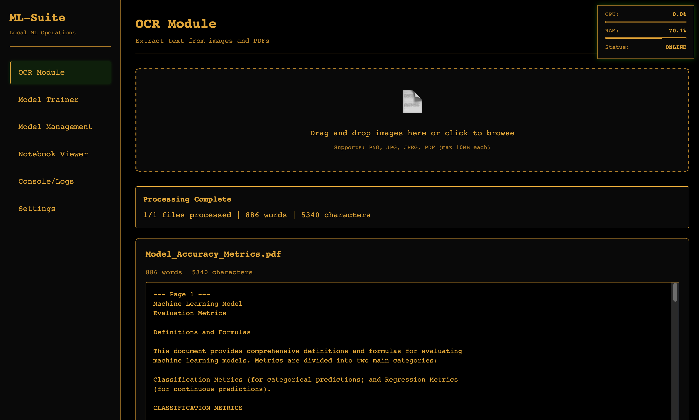
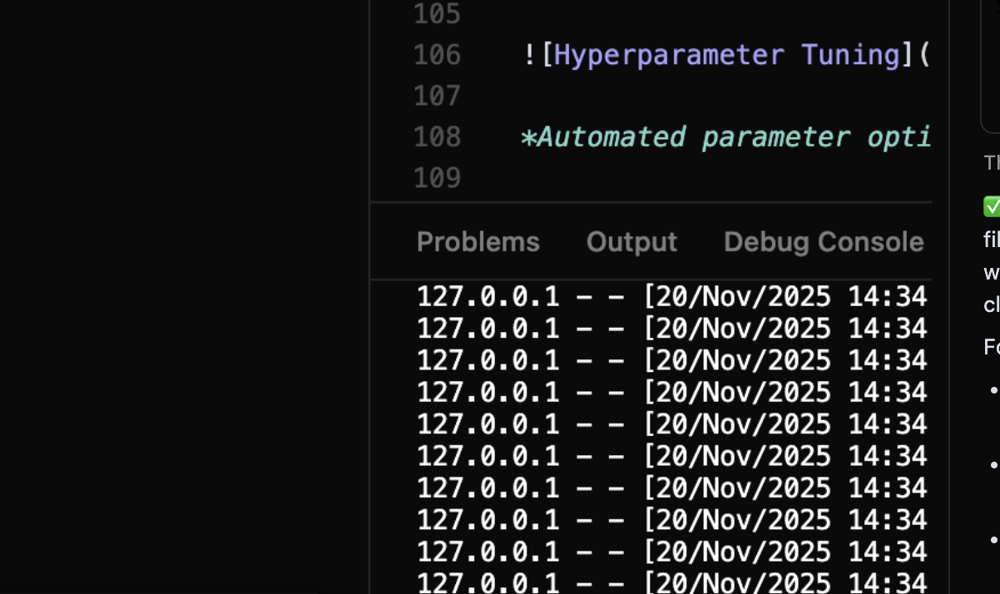
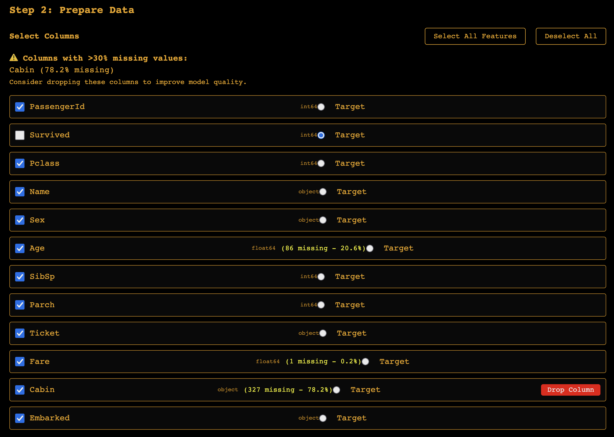
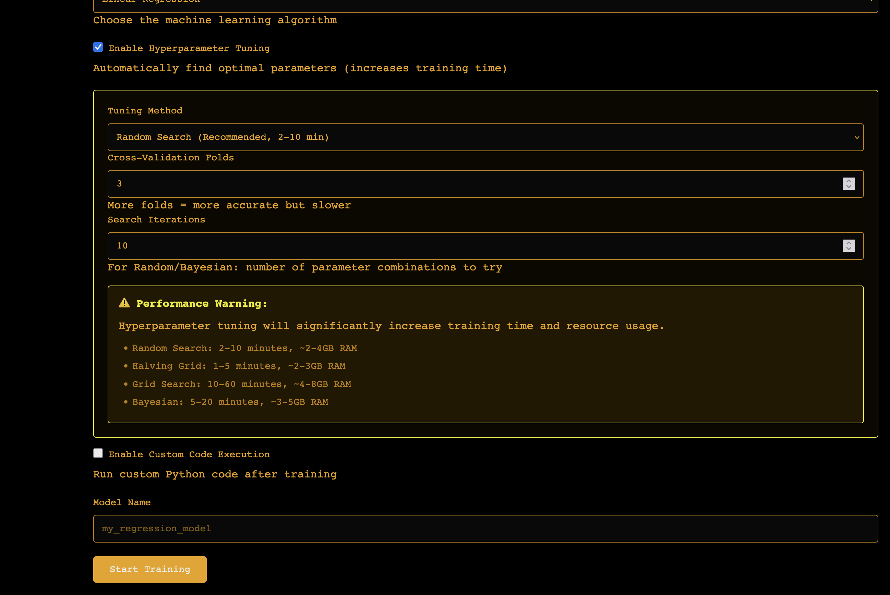

# ML-Suite

Local desktop ML application with OCR, model training, and comprehensive ML workflows. Runs entirely on localhost.

## Features

- **OCR Module**: Extract text from images and PDFs
- **Model Trainer**: Train regression, classification, clustering, and PCA models with visual interface
- **Model Management**: Save, load, download, and manage trained models
- **Hyperparameter Tuning**: Grid Search, Random Search, Bayesian Optimization
- **Visualizations**: Matplotlib charts (ROC, confusion matrix, residuals, feature importance, etc.)
- **Notebook Export**: Generate Jupyter notebooks with complete training code and visualizations
- **Console/Logs**: Real-time logging with filtering
- **System Monitoring**: CPU and RAM usage tracking
- **Customizable Themes**: 8 terminal themes with CRT effects and light modern theme

## Quick Start

### Prerequisites
- Python 3.8-3.13
- Tesseract OCR (for text extraction)
- Poppler (for PDF processing)

### Install

**macOS:**
```bash
brew install tesseract poppler libomp
./install.sh
```

**Linux (Ubuntu/Debian):**
```bash
sudo apt-get update
sudo apt-get install -y tesseract-ocr poppler-utils python3-pip python3-venv
./install.sh
```

**Windows:**
```cmd
choco install tesseract poppler -y
install.bat
```

*Alternatively, use `install.ps1` for PowerShell.*

## Run

```bash
# Activate virtual environment
source venv/bin/activate  # macOS/Linux
# or
venv\Scripts\activate.bat  # Windows

# Start application
python backend/app.py
```

Open `http://localhost:5000` in your browser.

## Features Overview

### 🔍 OCR Module
Extract text from images and PDFs using Tesseract OCR. Simply drag and drop your files and get instant text extraction.



*Upload images or PDFs and extract text with one click*

### 🤖 Model Training
Train machine learning models with an intuitive interface. Supports regression, classification, clustering, and dimensionality reduction.

#### How Model Training Works:
1. **Upload CSV Data** - Drag and drop your dataset
2. **Select Target & Features** - Choose what to predict and which columns to use
3. **Pick Model Type** - Choose from 15+ algorithms including XGBoost, Random Forest, SVM
4. **Configure Parameters** - Set hyperparameters or use auto-tuning
5. **Train & Evaluate** - Get performance metrics, visualizations, and downloadable models



*Complete ML workflow from data upload to trained model*

### 🧹 Data Preprocessing & Feature Selection
Clean and prepare your data for optimal model performance with built-in preprocessing tools.

#### Feature & Target Selection:
- **Target Variable**: Choose which column you want to predict (the "Y" variable)
- **Feature Columns**: Select which columns to use as predictors (the "X" variables)
- **Data Types**: Automatic detection of numerical vs categorical features
- **Missing Values**: Handle missing data with various strategies (drop, fill, impute)

#### Data Cleaning Options:
- **Remove Duplicates**: Automatically identify and remove duplicate rows
- **Handle Outliers**: Statistical methods to detect and treat outliers
- **Scale Features**: Standardize or normalize numerical features
- **Encode Categories**: Convert categorical variables to numerical format



*Smart data cleaning and feature selection for better model results*

### 🎯 Hyperparameter Tuning
Optimize model performance with automated hyperparameter tuning using Grid Search, Random Search, or Bayesian Optimization.



*Automated parameter optimization for better model performance*

### 🎨 Customizable Themes
Choose from multiple themes including retro terminal styles with CRT effects and modern light themes.


*8 different themes from classic terminal to modern light*

### 📊 Model Management
View, download, and manage all your trained models. Export complete Jupyter notebooks with training code and visualizations.

### 📝 Notebook Export
Generate fully functional Jupyter notebooks with your complete ML workflow, including data preprocessing, model training, and evaluation plots.

## Screen Recording

A screen recording is attached for help and understanding of the application's features and workflows.

## Project Structure

```
├── backend/          # Flask API and ML modules
├── frontend/         # Web interface (HTML/CSS/JS)
├── models/           # Trained models (auto-created)
├── uploads/          # Uploaded files (auto-created)
├── test_datasets/    # Sample datasets
└── install.*         # Platform-specific installers
```

## Getting Started

1. **Launch the app** and open `http://localhost:5000`
2. **Try OCR**: Upload an image or PDF to extract text
3. **Train a model**: Use the sample dataset in `test_datasets/creditcard_sample.csv`
4. **Explore features**: Switch between modules using the sidebar navigation

### Sample Dataset
A credit card fraud detection dataset is included in `test_datasets/creditcard_sample.csv` - perfect for trying classification models.

## Troubleshooting

- **Tesseract not found**: Install Tesseract OCR and ensure it's in your system PATH
- **XGBoost issues on macOS**: Install `libomp` with `brew install libomp`
- **Port already in use**: The app runs on port 5000 by default. Change it in `backend/config.py` if needed
- **Python dependency issues**: Try `pip install --upgrade pip setuptools wheel`

## License

MIT License - see project for details.
